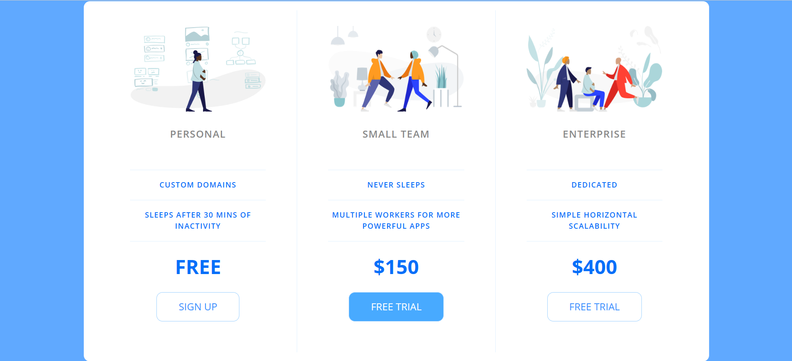

# Price Table

## Project Overview

The **Price Table** project is a responsive webpage designed to showcase different pricing plans for a product or service. The layout is built using **HTML5** and **CSS3**, creating a clean and modern interface. It features three pricing tiers: Personal, Small Team, and Enterprise, each with distinct features and pricing details.

## Features

- **Responsive Design**: The layout adjusts automatically for smaller screens with a column view and switches to a row view for wider screens (above 900px width).
- **Custom Font**: The project utilizes the **Open Sans** font from Google Fonts for a professional and modern look.
- **Interactive Buttons**: Each pricing plan includes a call-to-action button that changes appearance on hover, making it interactive and user-friendly.

## Technologies Used

- **HTML5**: Used for structuring the content of the webpage.
- **CSS3**: Used to style the pricing plans, buttons, and overall layout. The CSS includes a reset to ensure consistent styling across different browsers.
- **Google Fonts**: The **Open Sans** font is imported from Google Fonts for typography.

## File Structure

```bash
price-table/
│
├── index.html    # Main HTML file for the price tiers layout
├── app.css       # Custom CSS file for styling the layout and components
└── icons/        # Folder containing the icons for each pricing plan
```

## Setup Instructions

### 1. Clone the Repository

To get a local copy of the repository, clone it using Git:

```bash
git clone https://github.com/EmokeVagyas/price-table
```

### 2. Navigate to the Project Directory

```bash
cd price-table
```

### 3. Open the Project

Simply open `index.html` in a browser to view the website:

```bash
open index.html
```

Alternatively, you can use a local development server, such as **Live Server** in VSCode.

## Custom CSS Explanation

### General Reset (app.css)

A **CSS reset** is used to ensure consistent rendering across all browsers by removing any default styling. This is important to prevent inconsistencies and unpredictable layout issues:

```css
/* http://meyerweb.com/eric/tools/css/reset/ 
   v2.0 | 20110126 */
html, body, div, span, applet, object, iframe, h1, h2, h3, h4, h5, h6, p, blockquote, pre, a, abbr, acronym, address,
big, cite, code, del, dfn, em, img, ins, kbd, q, s, samp, small, strike, strong, sub, sup, tt, var, b, u, i, center, 
dl, dt, dd, ol, ul, li, fieldset, form, label, legend, table, caption, tbody, tfoot, thead, tr, th, td, article, 
aside, canvas, details, embed, figure, figcaption, footer, header, hgroup, menu, nav, output, ruby, section, summary,
time, mark, audio, video {
    margin: 0;
    padding: 0;
    border: 0;
    font-size: 100%;
    font: inherit;
    vertical-align: baseline;
}
```

### Body Styling

The **body** tag is styled to center the content using flexbox. The background color is set to a light blue (`#60a9ff`), and the body takes up the entire viewport height:

```css
body {
    background-color: #60a9ff;
    display: flex;
    justify-content: center;
    align-items: center;
    min-height: 100vh;
}
```

### Pricing Plans

The **pricing plans** are organized within a flexbox container, adjusting for different screen sizes. On smaller screens, the plans stack vertically, while on larger screens (over 900px), they align in a row.

```css
.panel {
    background-color: white;
    border-radius: 10px;
    padding: 15px 25px;
    width: 100%;
    max-width: 960px;
    display: flex;
    flex-direction: column;
    text-align: center;
    text-transform: uppercase;
}

@media (min-width: 900px) {
    .panel {
        flex-direction: row;
    }

    .pricing-plan {
        border-right: 1px solid #e1f1ff;
        padding: 25px 50px;
    }

    .pricing-plan:last-child {
        border-right: none;
    }
}
```

### Button Styling

The buttons in each pricing plan have a hover effect that changes the background color, enhancing the interactive experience. The `is-featured` class is used for the highlighted plan (Small Team), giving it a distinct style:

```css
.pricing-button {
    border: 1px solid #9dd1ff;
    border-radius: 10px;
    color: #348efe;
    display: inline-block;
    padding: 15px 35px;
    text-decoration: none;
    margin: 25px 0;
    transition: background-color 200ms ease-in-out;
}

.pricing-button:hover, .pricing-button:focus {
    background-color: #e1f1ff;
}

.pricing-button.is-featured {
    background-color: #48aaff;
    color: white;
}

.pricing-button.is-featured:hover, .pricing-button.is-featured:focus {
    background-color: #269aff;
    color: white;
}
```

## Screenshots

### Price Tiers


## License

This project is licensed under the MIT License - see the [LICENSE](LICENSE) file for details.

## Contact

Created by **Emőke Vagyas** - [GitHub](https://github.com/EmokeVagyas) - feel free to reach out for any questions or collaborations!